# Walkthrough Challenge 2 - Data Agent becomes mission control

[Previous Challenge 1 Solution](../challenge-01/solution-01.md) - **[Home](../../README.md)** - [Back to Challenge 2 Info](../../challenges/challenge-02.md)

### Contents
[Lab overview](#lab-overview)

1. [Enable the Power BI Trial](#1-enable-the-power-bi-trial)
2. [Create a Semantic Model from the Lakehouse](#2-create-a-semantic-model-from-the-lakehouse)
3. [Create the Relationships](#3-create-the-relationships)
4. [Auto-Create a Report](#4-auto-create-a-report)
5. [Refine the Report with Prompts](#5-refine-the-report-with-prompts)
6. [Manually Fine-Tune the Report](#6-manually-fine-tune-the-report)
7. [Prepare the Data for AI](#7-prepare-the-data-for-ai)
8. [Optional: Add Verified Answers](#8-optional-add-verified-answers)
9. [Set Up AI Instructions](#9-set-up-ai-instructions)
10. [Explore Power BI Copilot](#10-explore-power-bi-copilot)

[Summary](#summary)

# Lab Overview

In this walkthrough, you will activate the required Power BI trial, create a semantic model from your Lakehouse, and configure the core relationships and metadata needed for reporting in Microsoft Fabric.

Next, you will auto-create an initial report, refine it with prompts and manual edits, and prepare the semantic model for AI by simplifying the schema, reviewing verified answers, and adding AI instructions.

By the end of this walkthrough, you will have a report-ready and AI-ready semantic model that can be explored with Power BI Copilot using natural language questions.

## 1. Enable the Power BI Trial

In this step, you activate the required Power BI / Fabric trial so you can use reporting and AI capabilities in Microsoft Fabric.

<table style="table-layout: auto; width: 100%;">
<colgroup>
<col style="width: 72%;">
<col style="width: 28%;">
</colgroup>
<tr><th>Narrative</th><th>Notes</th></tr>
<tr><td>Click your profile image (1), start the <b>Fabric Free Trial (2)</b>, select <b>Sweden Central</b> as the trial region (3) to align with your Lakehouse and databases, and confirm activation (4).</td><td>You need a Power BI license to create and use AI-driven reports directly in Microsoft Fabric.</td></tr>
<tr><td colspan="2" align="center">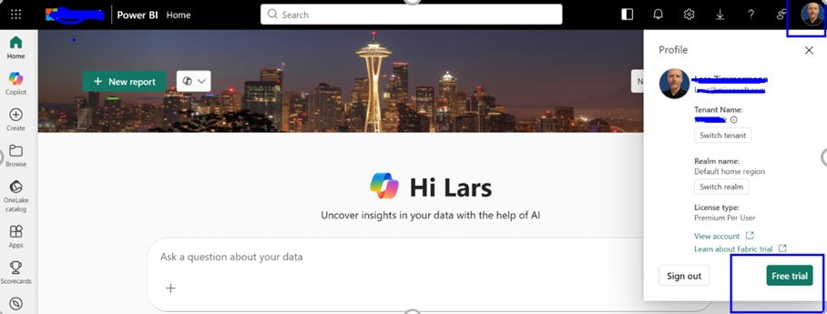</td></tr>
</table>

## 2. Create a Semantic Model from the Lakehouse

In this task, you will create a semantic model from the Lakehouse tables. A semantic model is the reusable layer that defines tables, relationships, calculations, and security, making data business-ready for reports and analysis.

<table style="table-layout: auto; width: 100%;">
<colgroup>
<col style="width: 72%;">
<col style="width: 28%;">
</colgroup>
<tr><th>Narrative</th><th>Notes</th></tr>
<tr><td>In the Lakehouse view, select <b>New semantic model</b> from the top menu.</td><td></td></tr>
<tr><td colspan="2" align="center">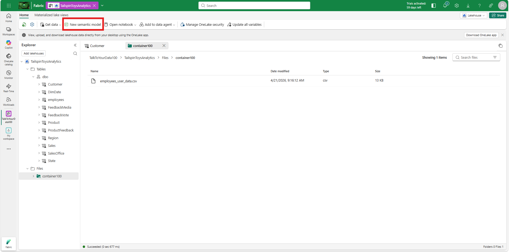</td></tr>
<tr><td>In the New semantic model dialog: enter the semantic model name (1), click <b>Select all</b> (2) to include all available tables, and click <b>Confirm</b> (3).</td><td>Example semantic model name: <code>TalkToYourDataSemanticModel</code>.</td></tr>
<tr><td colspan="2" align="center">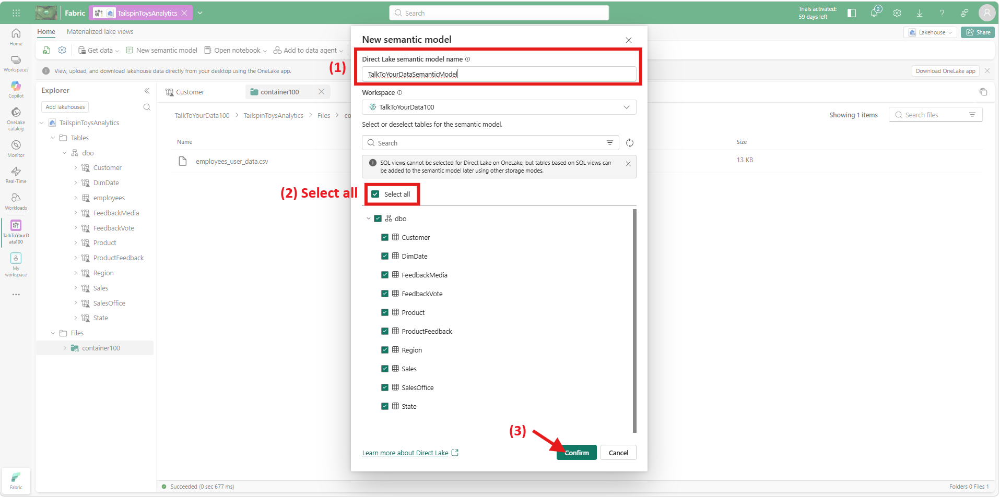</td></tr>
<tr><td>Before clicking <b>Confirm</b>, make sure newly created tables (for example <b>employees</b>) is included in the selection.</td><td>Use your screenshot below to verify that the table is selected.</td></tr>
<tr><td colspan="2" align="center">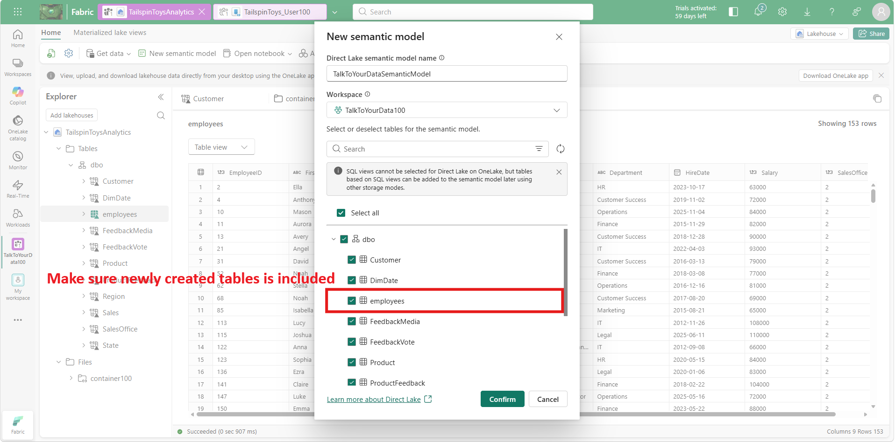</td></tr>
<tr><td>Click on <b>Confirm</b>.</td><td></td></tr>
<tr><td colspan="2" align="center">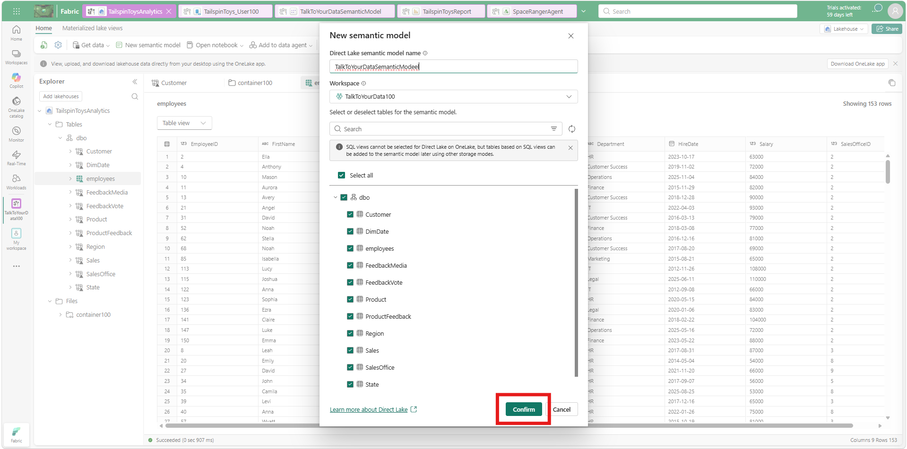</td></tr>
<tr><td>Wait until the semantic model is successfully created. You will then see it listed in the workspace.</td><td>If creation fails, switch once to the SQL Analytics Endpoint view and create it from there.</td></tr>
<tr><td colspan="2" align="center">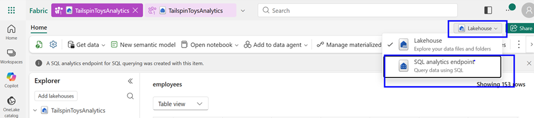</td></tr>
<tr><td>Navigate back to the workspace by clicking the workspace icon in the left navigation.</td><td></td></tr>
<tr><td colspan="2" align="center">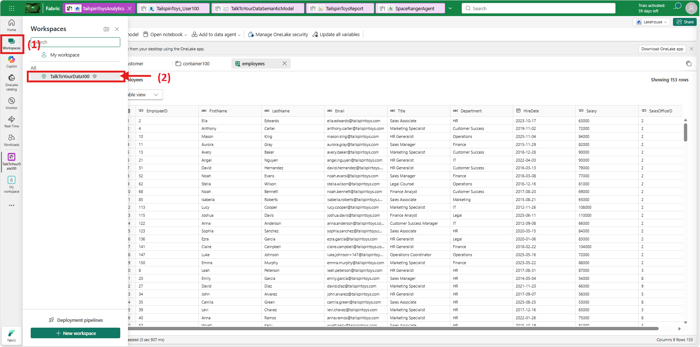</td></tr>
<tr><td>Verify that the semantic model was created successfully.</td><td></td></tr>
<tr><td colspan="2" align="center">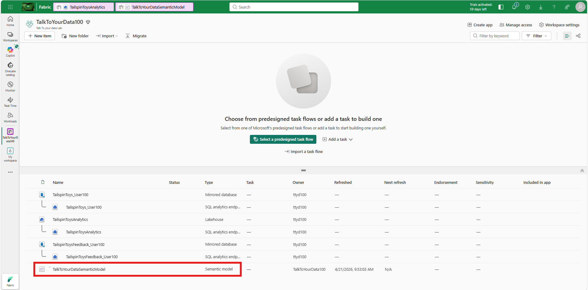</td></tr>
</table>

## 3. Create the Relationships

In this task, you will optimize the semantic model by creating the required relationships and validating the model structure.

<table style="table-layout: auto; width: 100%;">
<colgroup>
<col style="width: 72%;">
<col style="width: 28%;">
</colgroup>
<tr><th>Narrative</th><th>Notes</th></tr>
<tr><td>Confirm the semantic model is in <b>Edit mode</b> before optimization work.</td><td>Relationship and metadata changes are only available in Editing mode.</td></tr>
<tr><td colspan="2" align="center">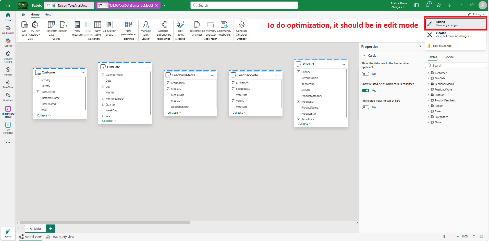</td></tr>
<tr><td>Click <b>Manage relationships</b> from the ribbon while in Editing mode.</td><td>This opens the relationship manager for creating and adjusting joins.</td></tr>
<tr><td colspan="2" align="center">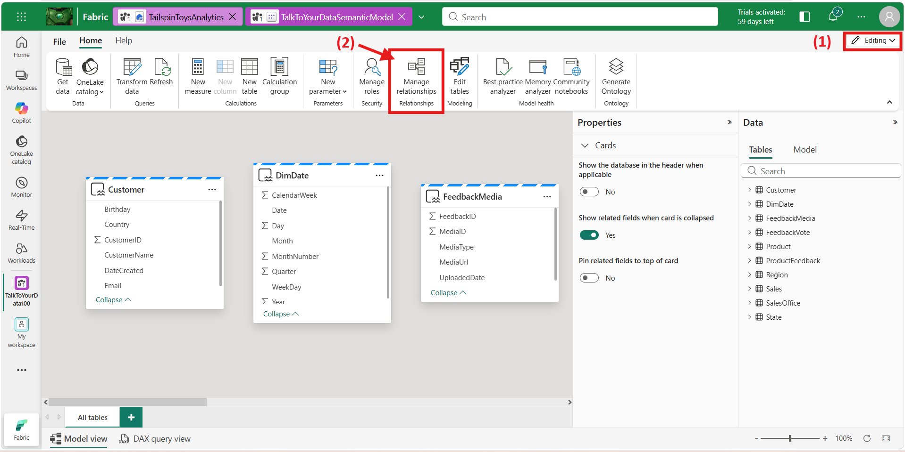</td></tr>
<tr><td>In the Manage relationships dialog, click <b>New relationship</b>.</td><td>Start defining core fact-to-dimension joins.</td></tr>
<tr><td colspan="2" align="center">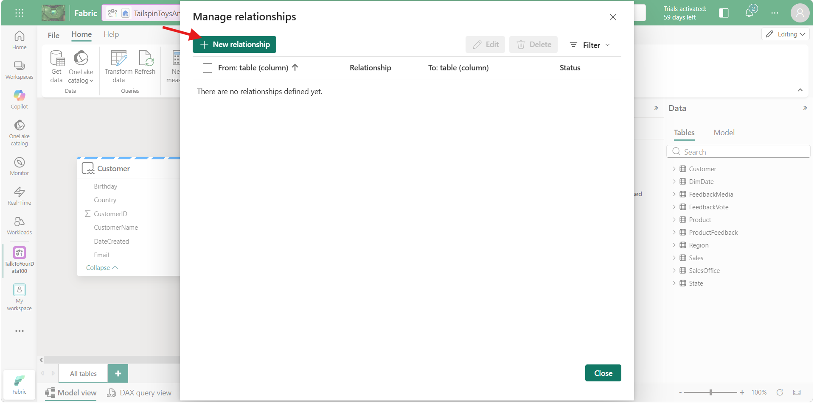</td></tr>
<tr><td>Create <b>Sales[CustomerID] -> Customer[CustomerID]</b> and click <b>Save</b>.</td><td>Enables customer-level analysis of sales.</td></tr>
<tr><td colspan="2" align="center">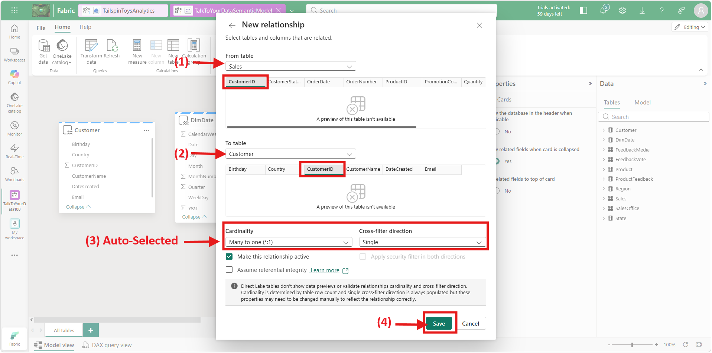</td></tr>
<tr><td>Create <b>Sales[OrderDate] -> DimDate[Date]</b>.</td><td>Required for month, quarter, and year reporting.</td></tr>
<tr><td colspan="2" align="center">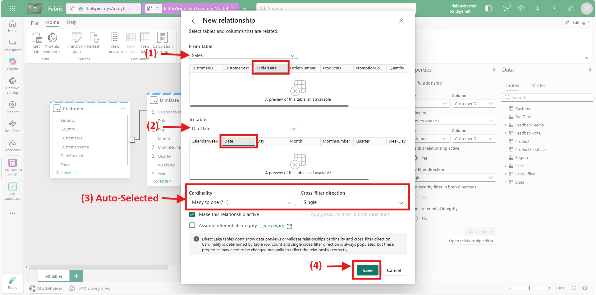</td></tr>
<tr><td>Create <b>ProductFeedback[ProductID] -> Product[ProductID]</b>.</td><td>Connects feedback records to the product dimension.</td></tr>
<tr><td colspan="2" align="center">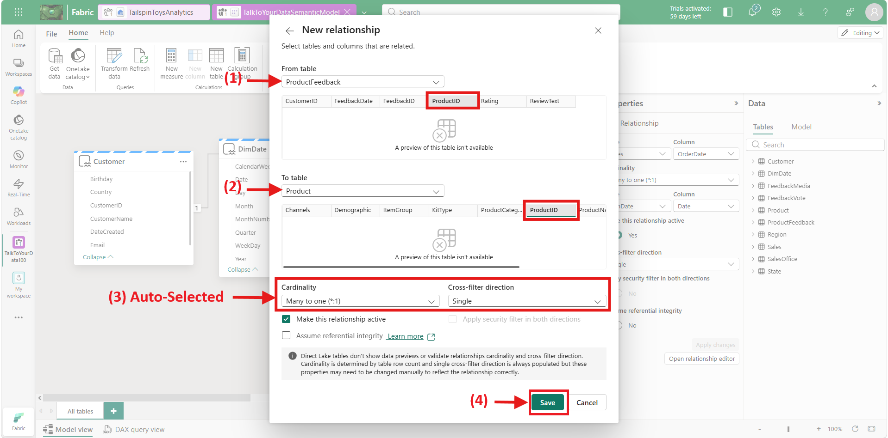</td></tr>
<tr><td>Create <b>State[RegionID] -> Region[RegionID]</b>.</td><td>Builds the state-to-region geography hierarchy.</td></tr>
<tr><td colspan="2" align="center">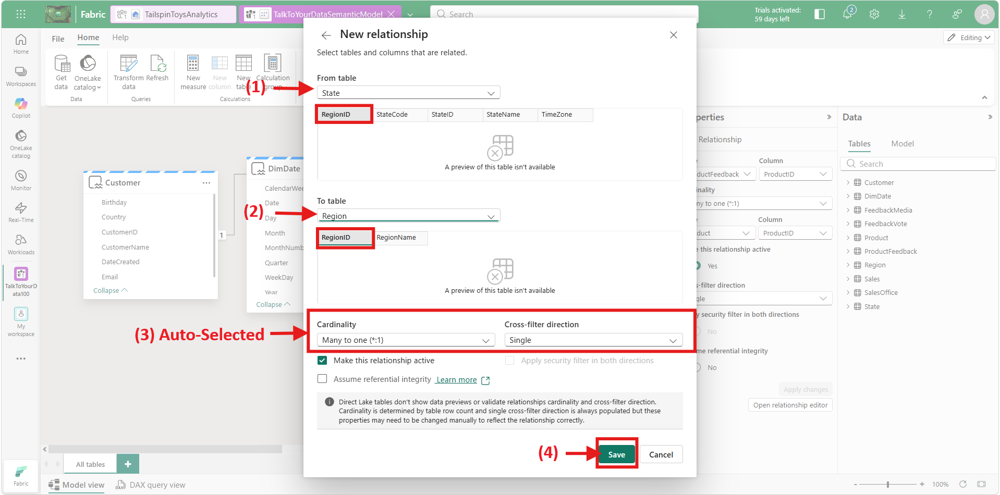</td></tr>
<tr><td>Create <b>Sales[CustomerStateID] -> State[StateID]</b>.</td><td>Maps sales to customer location.</td></tr>
<tr><td colspan="2" align="center">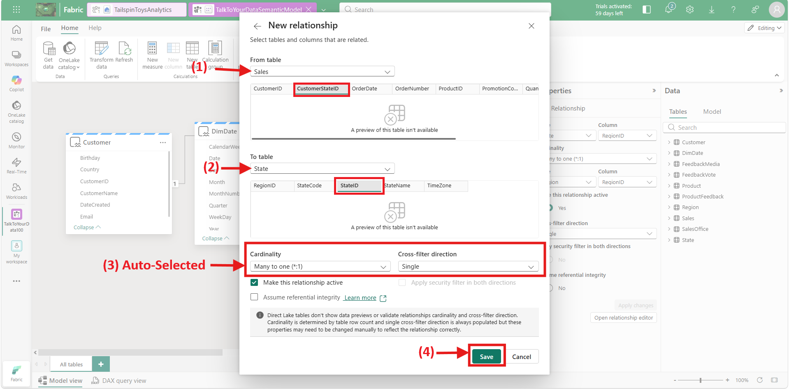</td></tr>
<tr><td>Create <b>Sales[ProductID] -> Product[ProductID]</b>.</td><td>This is the core product join for sales analytics.</td></tr>
<tr><td colspan="2" align="center">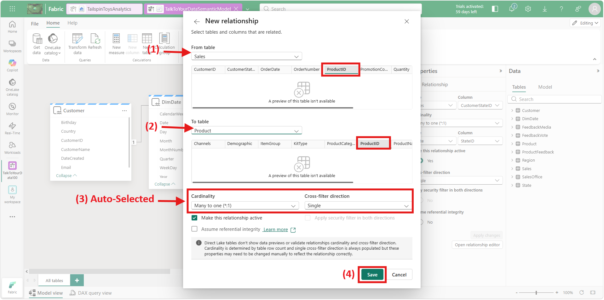</td></tr>
<tr><td>Create <b>employees[SalesOfficeID] -> SalesOffice[SalesOfficeID]</b>.</td><td>Enables organizational analysis by office and region. Fabric may auto-select Email first because it is a common column, so make sure you choose <b>SalesOfficeID</b> before saving the relationship.</td></tr>
<tr><td colspan="2" align="center">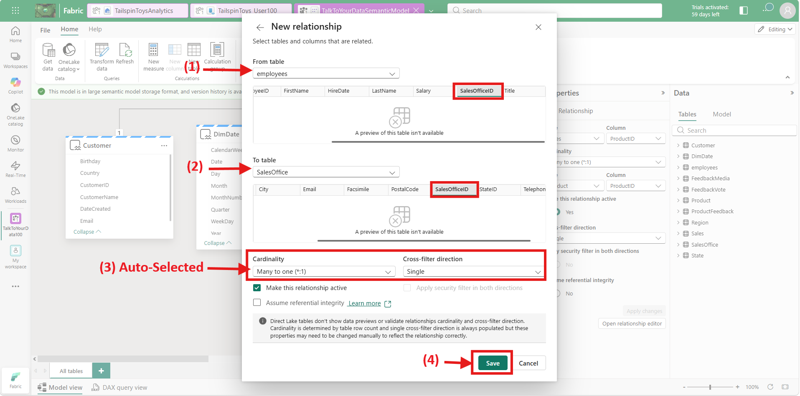</td></tr>
<tr><td>Review all listed relationships and confirm they are <b>Active</b>, then close the dialog.</td><td>Quick validation to ensure no required join is missing.</td></tr>
<tr><td colspan="2" align="center">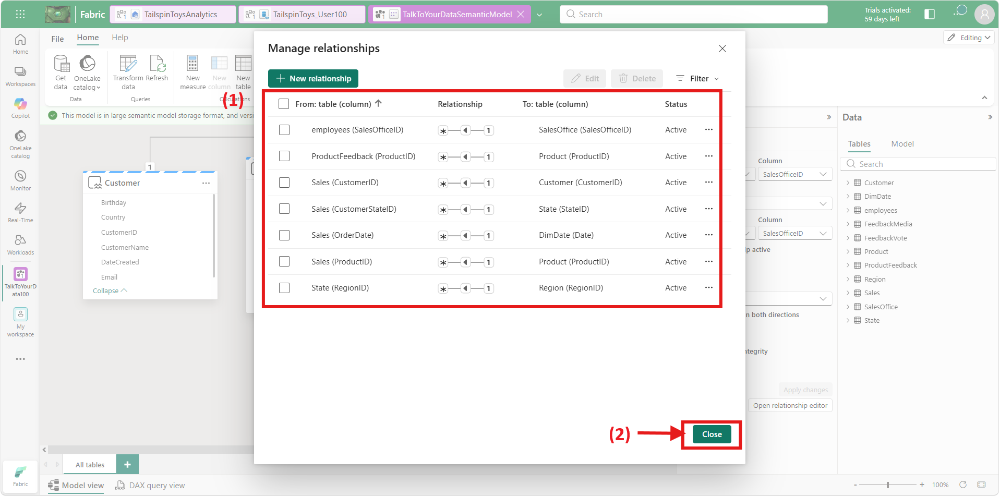</td></tr>
<tr><td>Verify the model diagram now shows connected relationship lines.</td><td>The model should now reflect the intended star / multi-fact shape.</td></tr>
<tr><td colspan="2" align="center">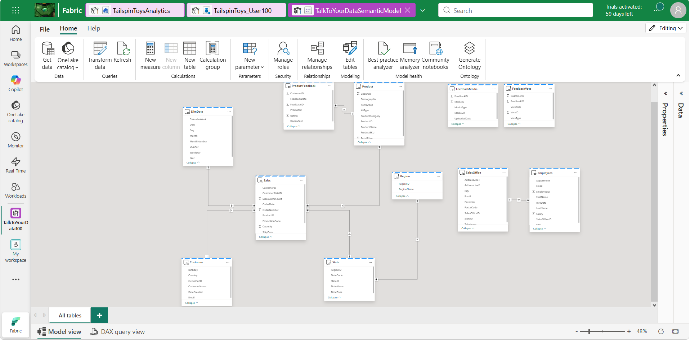</td></tr>

<tr><td colspan="2">
In this semantic model, you use a <b>multi-fact model</b>, which means the semantic model contains <b>more than one fact table</b>, where each fact table represents a different business process. This approach is common when multiple types of business activities need to be analyzed together while still sharing common dimensions.
<ul>
  <li><b>Two Fact Tables in This Model</b>
    <ul>
      <li><b>Sales</b>: records transactional sales data such as orders, quantity, and revenue.</li>
      <li><b>Product Feedback</b>: records product feedback data such as ratings and reviews from customers.</li>
    </ul>
  </li>
  <li><b>Why Use a Multi-Fact Model?</b>
    <ul>
      <li>Analyze sales metrics and customer feedback metrics independently.</li>
      <li>Compare insights across different business processes.</li>
      <li>Maintain a clean and scalable semantic model design.</li>
      <li>Avoid mixing unrelated measures into a single fact table.</li>
    </ul>
  </li>
</ul>
</td></tr>
<tr><td colspan="2" align="center">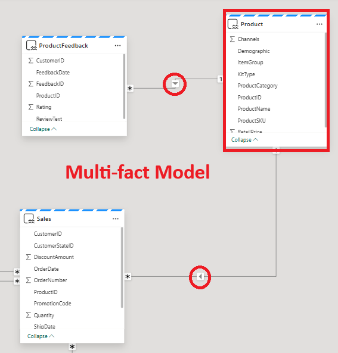</td></tr>

<tr><td colspan="2">
<ul>
  <li>In the <b>Edit relationship</b> dialog, locate <b>Cross-filter direction</b> and change the value to <b>Both</b> (1). This allows filters to flow in both directions between the <b>ProductFeedback</b> fact table and the <b>Product</b> dimension table.</li>
  <li>Click <b>Save</b> (2) to apply the updated relationship settings.</li>
  <li>The relationship between <b>ProductFeedback</b> and <b>Product</b> now supports bidirectional filtering, enabling combined analysis of product attributes and customer feedback.</li>
</ul>
</td></tr>
<tr><td colspan="2" align="center">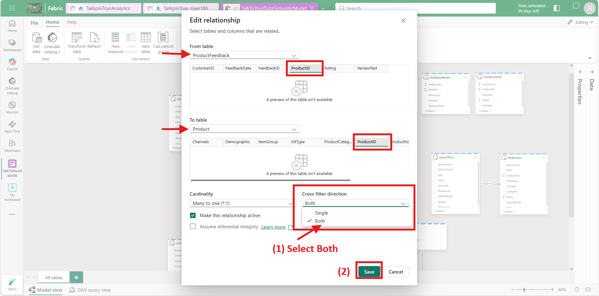</td></tr>
<tr><td>Apply the same between the <b>Sales</b> table and the <b>Product</b> table by changing Cross-filter direction the value to <b>Both</b> (1). This allows filters to flow in both directions. Click <b>Save</b> (2) to apply the updated relationship settings. Sales metrics can now be analyzed together with product attributes using bidirectional filtering.</td><td> </td></tr>
<tr><td colspan="2" align="center">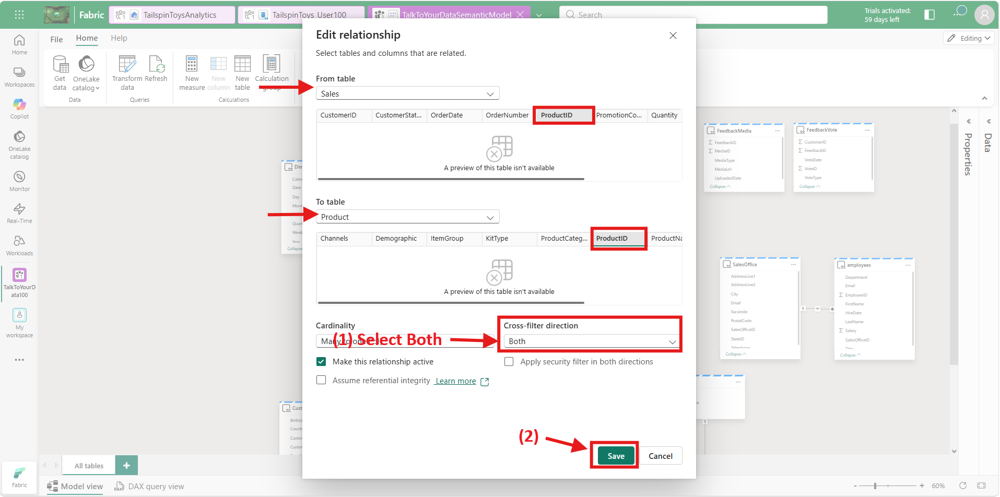</td></tr>
<tr><td>Recheck the model diagram after cross-filter updates.</td><td>Confirm relationship behavior is stable before metadata edits.</td></tr>
<tr><td colspan="2" align="center">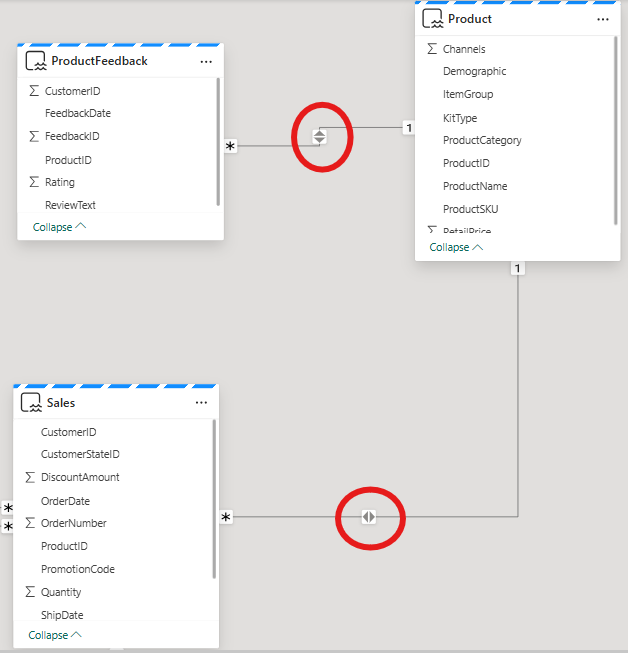</td></tr>
<tr><td>Switch from <b>Editing</b> back to <b>Viewing</b> mode after optimization is complete.</td><td> </td></tr>
<tr><td colspan="2" align="center">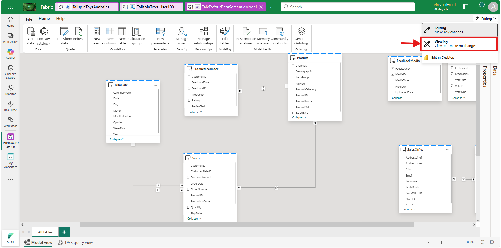</td></tr>
<tr><td><b>Congratulations!</b> Your data model is now ready to use!</td></tr>

</table>

## 4. Auto-Create a Report

In this step, use the semantic model to automatically generate the first report page. Review the suggested visuals and use the generated report as the starting point for the next refinement steps.

<table style="table-layout: auto; width: 100%;">
<colgroup>
<col style="width: 72%;">
<col style="width: 28%;">
</colgroup>
<tr><th>Narrative</th><th>Notes</th></tr>
<tr><td>Navigate back to the workspace by clicking the workspace icon in the left navigation.</td><td></td></tr>
<tr><td colspan="2" align="center"></td></tr>
<tr><td>Open the semantic model and select <b>Explore</b> from the top menu, then click <b>Auto-create a report</b>.</td><td>This generates a first draft of the report automatically based on the available fields and data patterns.</td></tr>
<tr><td colspan="2" align="center">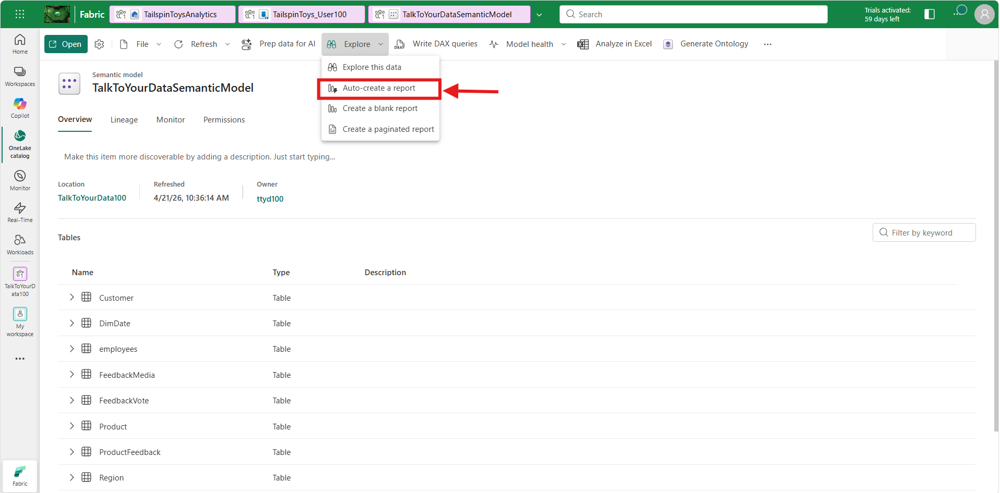</td></tr>
<tr><td>Review the generated <b>Quick summary</b> page and check the suggested visuals.</td><td>You can also adjust the field selection in the <b>Your data</b> pane on the right if needed.</td></tr>
<tr><td colspan="2" align="center">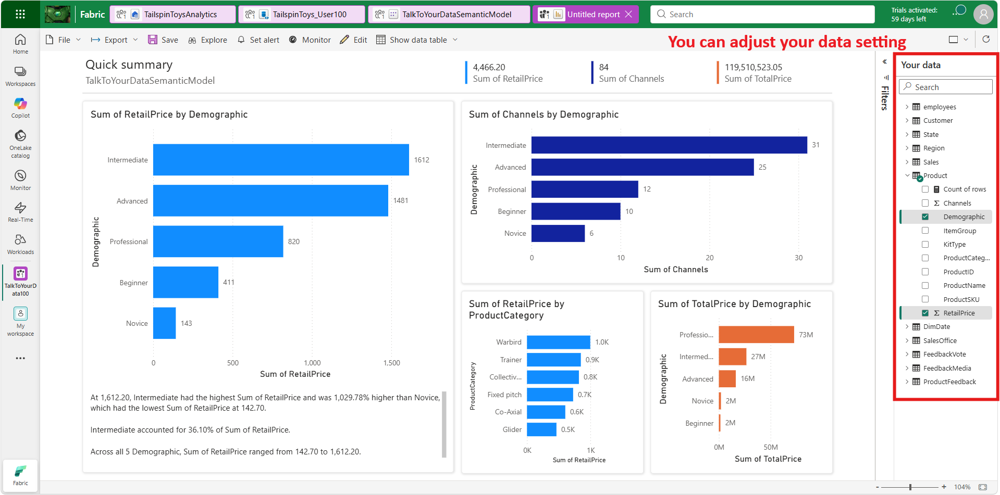</td></tr>
</table>

## 5. Refine the Report with Prompts

In this step, use prompts or Copilot suggestions to improve the auto-generated report. Ask for changes such as <b>new visuals, different chart types or clearer titles</b> so the report answers the key business questions more effectively.

<table style="table-layout: auto; width: 100%;">
<colgroup>
<col style="width: 72%;">
<col style="width: 28%;">
</colgroup>
<tr><th>Narrative</th><th>Notes</th></tr>
<tr><td>Switch to <b>Edit</b> mode from the report menu and confirm with <b>Continue</b>.</td><td>Use this mode to manually refine and optimize the generated report.</td></tr>
<tr><td colspan="2" align="center">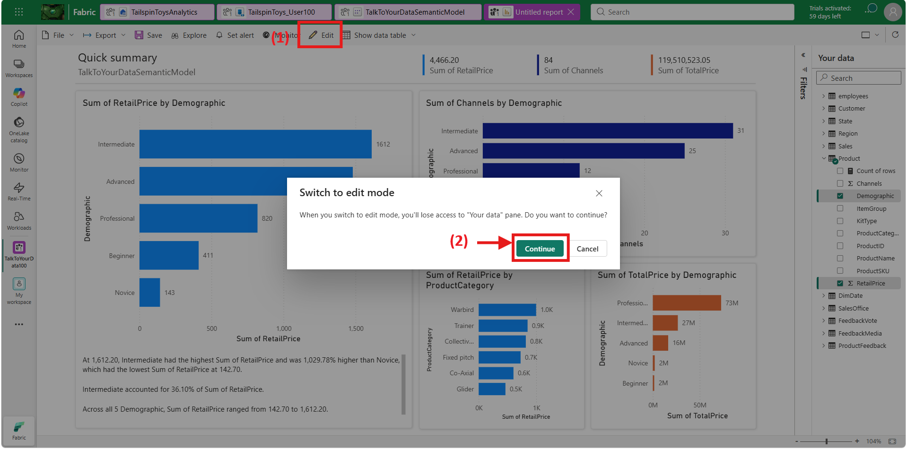</td></tr>
<tr><td> First click the <b>Copilot icon (1)</b>. Then a sidebar opens to the left where you can <b>add your prompt (2)</b> to add something on the report page, like: <code>Provide a detailed, insight-focused overview of "Sum of Quantity by RegionName" visual's data.</code>   Use Copilot prompts to refine the auto-generated report with better visuals, clearer wording, or additional insights.</td><td>This screenshot shows an example of how Power BI Copilot can help improve the report.</td></tr>
<tr><td colspan="2" align="center">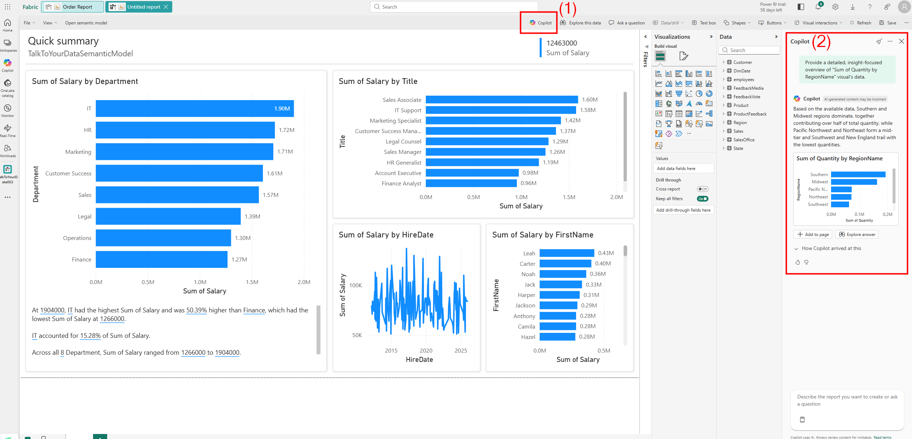</td></tr>
</table>

## 6. Manually Fine-Tune the Report

If you prefer you can also manually adjust visuals, formatting, and layout, and if needed open the semantic model behind the report for additional optimization (e.g. DAX measures).

<table style="table-layout: auto; width: 100%;">
<colgroup>
<col style="width: 72%;">
<col style="width: 28%;">
</colgroup>
<tr><th>Narrative</th><th>Notes</th></tr>
<tr><td><b>Now try yourself editing the report!</b>  </td><td><tr>
<tr><td> When you are done, click <b>Save</b>, enter a report name, and confirm.</td><td>This stores the generated and refined report in your workspace.</td></tr>
<tr><td colspan="2" align="center">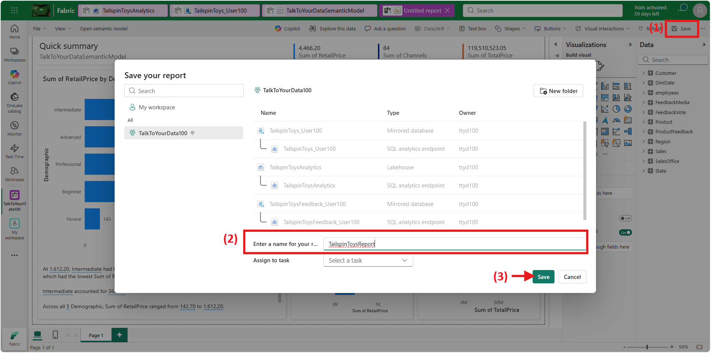</td></tr>
</table>

## 7. Prepare the Data for AI

In this task, you will simplify the data schema and prepare the model for AI and Copilot scenarios, enabling more accurate natural language querying and better responses.

<table style="table-layout: auto; width: 100%;">
<colgroup>
<col style="width: 72%;">
<col style="width: 28%;">
</colgroup>
<tr><th>Narrative</th><th>Notes</th></tr>
<tr><td>Open your workspace and open the semantic model in Microsoft Fabric.</td><td></td></tr>
<tr><td colspan="2" align="center">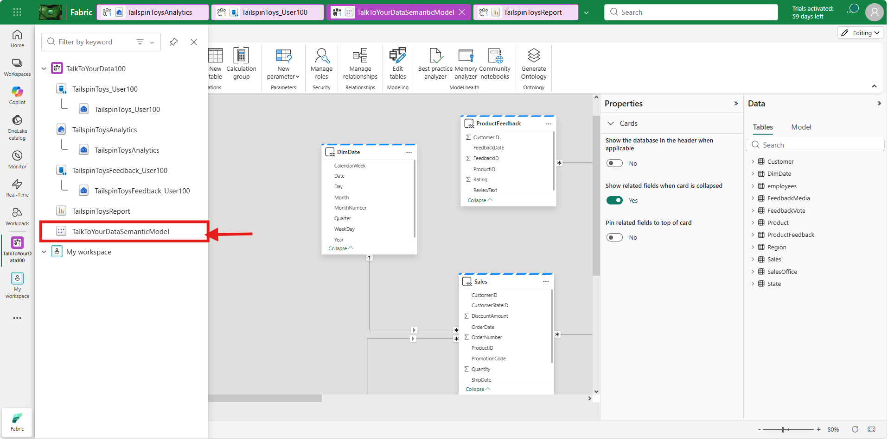</td></tr>
<tr><td>From the top menu, select <b>Prep data for AI</b>.</td><td></td></tr>
<tr><td colspan="2" align="center">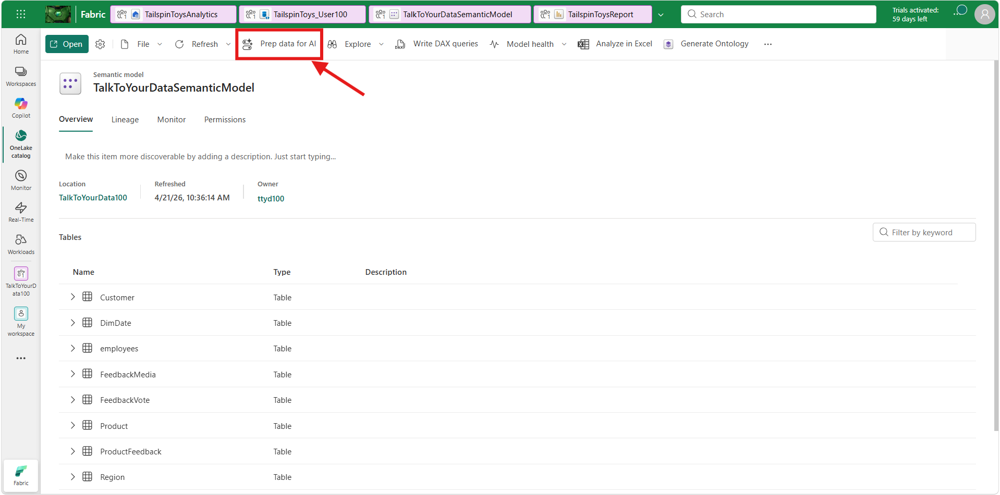</td></tr>
<tr><td>In the <b>Prep data for AI</b> dialog, review and configure the steps: simplify the data schema, verified answers, and AI instructions.</td><td></td></tr>
<tr><td colspan="2" align="center">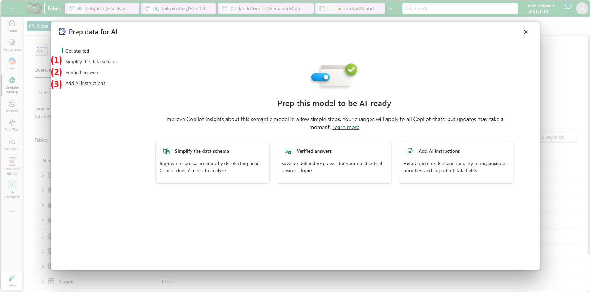</td></tr>
<tr><td>Select <b>Simplify the data schema</b> from the left navigation and expand the semantic model to view all tables and columns.</td><td>This step keeps only the relevant tables and columns available to AI, improving query quality and response accuracy.</td></tr>
<tr><td colspan="2" align="center">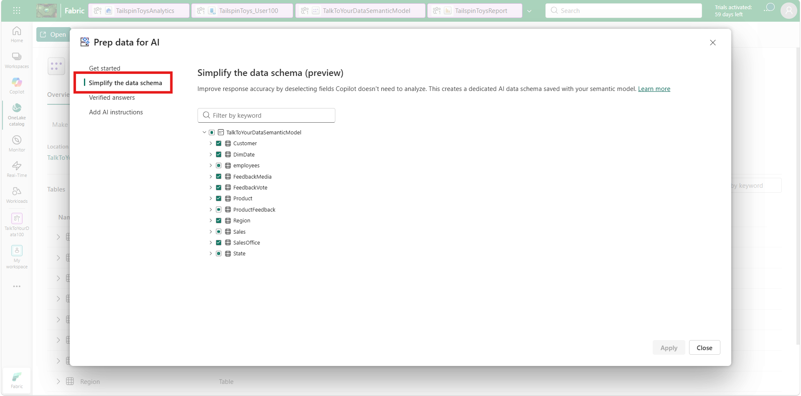</td></tr>
<tr><td>Review the table selections carefully.</td><td><b>Customer</b>: uncheck <code>CustomerID</code> and <code>DateCreated</code> <b>DimDate</b>: keep all columns checked <b>Employees</b>: uncheck <code>EmployeeID</code> and <code>SalesOfficeID</code> <b>FeedbackMedia</b> and <b>FeedbackVote</b>: uncheck all columns</td></tr>
<tr><td colspan="2" align="center">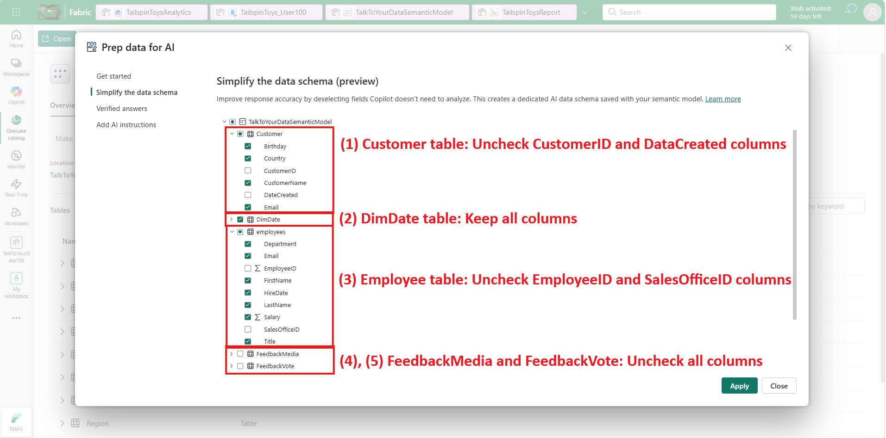</td></tr>
<tr><td>Continue simplifying the model based on business relevance.</td><td><b>Product</b>: uncheck <code>ProductID</code> <b>ProductFeedback</b>: uncheck <code>CustomerID</code>, <code>FeedbackID</code>, and <code>ProductID</code> <b>Region</b>: uncheck <code>RegionID</code></td></tr>
<tr><td colspan="2" align="center">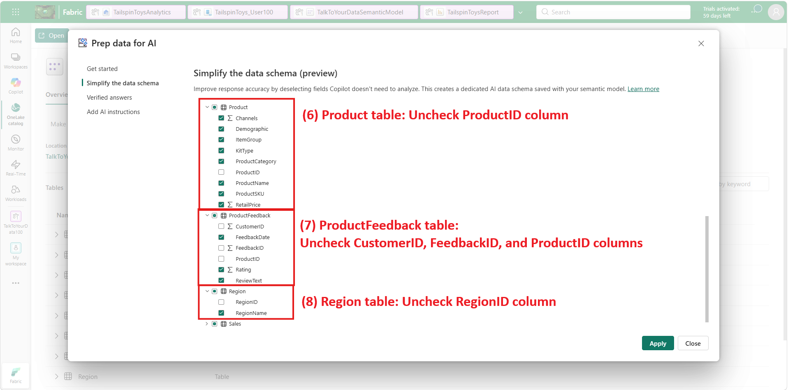</td></tr>
<tr><td>Review the remaining fact and dimension tables.</td><td><b>Sales</b>: uncheck <code>CustomerID</code>, <code>CustomerStateID</code>, <code>OrderDate</code>, <code>ProductID</code>, and <code>ShipDate</code> <b>SalesOffice</b>: uncheck <code>SalesOfficeID</code> and <code>StateID</code></td></tr>
<tr><td colspan="2" align="center">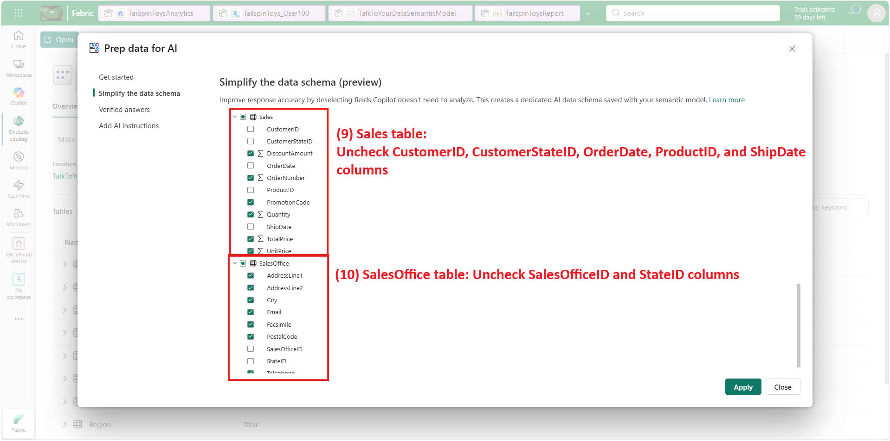</td></tr>
<tr><td>Finalize the schema cleanup.</td><td><b>State</b>: uncheck <code>RegionID</code> and <code>StateID</code></td></tr>
<tr><td colspan="2" align="center">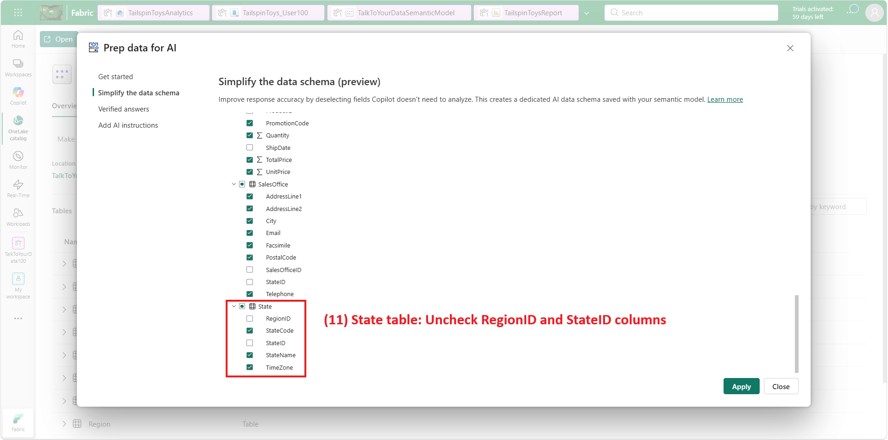</td></tr>
<tr><td>After reviewing your selections, click <b>Apply</b>.</td><td></td></tr>
<tr><td colspan="2" align="center">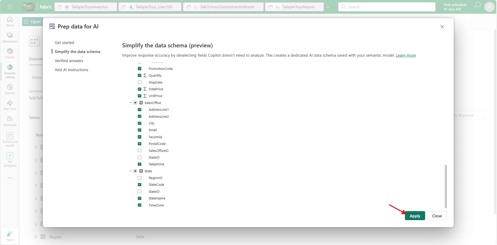</td></tr>
</table>

## 8. Optional: Add Verified Answers

Verified answers are optional and are created from <b>Power BI reports</b>, not directly in the <b>Prep data for AI</b> dialog.

<table style="table-layout: auto; width: 100%;">
<colgroup>
<col style="width: 72%;">
<col style="width: 28%;">
</colgroup>
<tr><th>Narrative</th><th>Notes</th></tr>
<tr><td>In the left navigation, select <b>Verified answers (preview)</b>.</td><td>No configuration is required at this step. Leave this section unchanged and continue.</td></tr>
<tr><td colspan="2" align="center">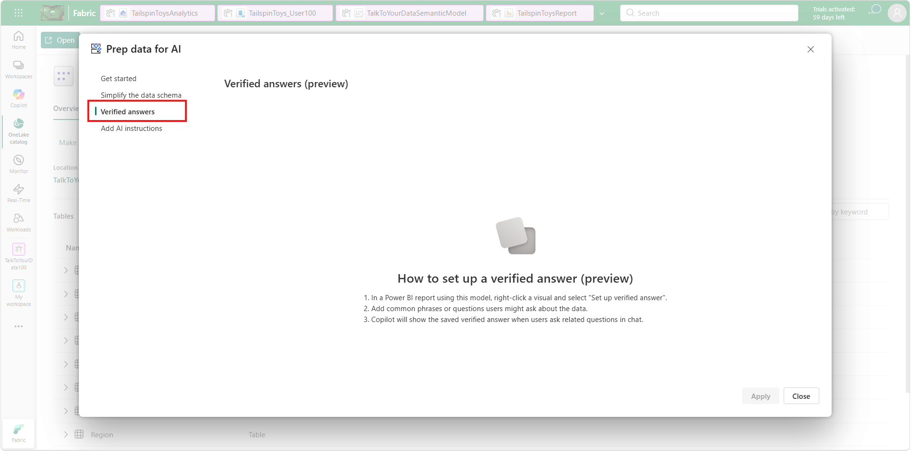</td></tr>
</table>

## 9. Set Up AI Instructions

In this task, you will add business-focused AI instructions so Copilot and other AI experiences can interpret the semantic model correctly.

<table style="table-layout: auto; width: 100%;">
<colgroup>
<col style="width: 72%;">
<col style="width: 28%;">
</colgroup>
<tr><th>Narrative</th><th>Notes</th></tr>
<tr><td>In the left navigation, select <b>Add AI instructions (preview)</b>. In the text box, add clear, business-focused instructions, then click <b>Apply</b>.</td><td></td></tr>
<tr><td colspan="2" align="center">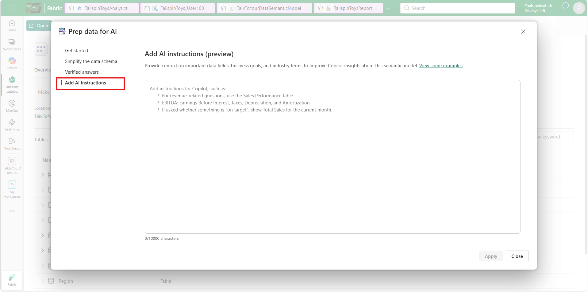</td></tr>
<tr><td>See the example section below for a sample instruction set.</td><td></td></tr>
<tr><td colspan="2" align="center">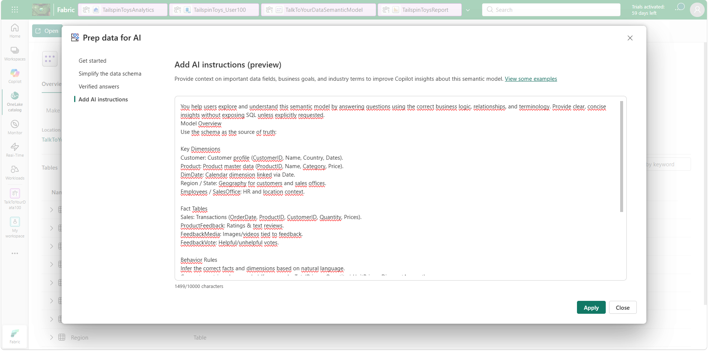</td></tr>
<tr><td colspan="2">

<b>Example of AI Instructions</b> (click to expand)
 
You help users explore and understand this semantic model by answering questions using the correct business logic, relationships, and terminology. Provide clear, concise insights without exposing SQL unless explicitly requested.

Model Overview  
Use the schema as the source of truth:

Key Dimensions  
Customer: Customer profile (CustomerID, Name, Country, Dates).  
Product: Product master data (ProductID, Name, Category, Price).  
DimDate: Calendar dimension linked via Date.  
Region / State: Geography for customers and sales offices.  
Employees / SalesOffice: HR and location context.

Fact Tables  
Sales: Transactions (OrderDate, ProductID, CustomerID, Quantity, Prices).  
ProductFeedback: Ratings & text reviews.  
FeedbackMedia: Images/videos tied to feedback.  
FeedbackVote: Helpful/unhelpful votes.

Behavior Rules  
Infer the correct facts and dimensions based on natural language.  
Compute metrics when needed (for example, <code>TotalPrice = Quantity * UnitPrice – DiscountAmount</code>).  
Treat nullable columns gracefully.  
Explain calculations briefly in your answer.  
Use business-friendly wording instead of column names unless asked.  
Avoid making up fields or relationships not present in the schema.

Guidance for Common Requests  
"Top products" -> Use <code>Sales.Quantity</code> or <code>TotalPrice</code>.  
"Customer trends" -> Use Customer and Sales.  
"Rating analysis" -> Use <code>ProductFeedback.Rating</code>.  
"Regional performance" -> Use State / Region with Sales.  
"Employee counts or salaries" -> Use Employees grouped by SalesOffice or Department.

</td></tr>
</table>

## 10. Explore Power BI Copilot

In this step, open Power BI Copilot from the report and ask natural language questions about sales, products, ratings, or regional performance. Use the prepared semantic model and AI instructions to validate that Copilot returns clear, business-friendly answers.

<table style="table-layout: auto; width: 100%;">
<colgroup>
<col style="width: 72%;">
<col style="width: 28%;">
</colgroup>
<tr><th>Narrative</th><th>Notes</th></tr>
<tr><td>Navigate back to the workspace by clicking the workspace icon in the left navigation.</td><td></td></tr>
<tr><td colspan="2" align="center"></td></tr>
<tr><td>Open the previously created Report.</td><td></td></tr>
<tr><td colspan="2" align="center">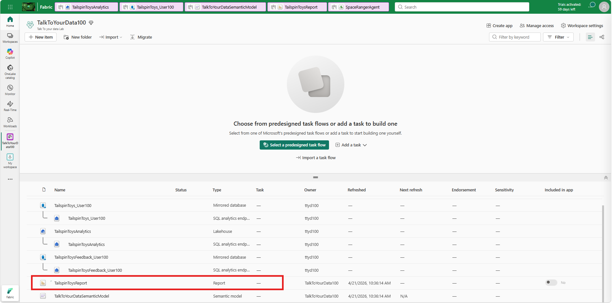</td></tr>
<tr><td>Click <b>Copilot</b> in the report and select <b>Get started</b>.</td><td>You can now ask natural language questions directly against the prepared report and semantic model.</td></tr>
<tr><td colspan="2" align="center">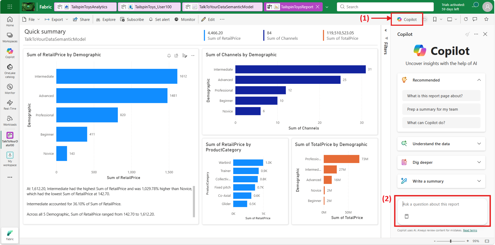</td></tr>
</table>

## Summary

In this lab, you have accomplished the following:

- Enabled the required Power BI / Fabric trial to unlock reporting and AI capabilities.
- Created and optimized a semantic model from the Lakehouse for reporting and analysis.
- Defined the key relationships and improved the model structure for better filtering and interpretation.
- Generated and refined a report using both automatic and manual editing approaches.
- Prepared the semantic model for AI by simplifying the schema, reviewing verified answers, and adding business-focused AI instructions.

[Next Challenge 3 Step-by-Step Solution](../challenge-03/solution-03.md)