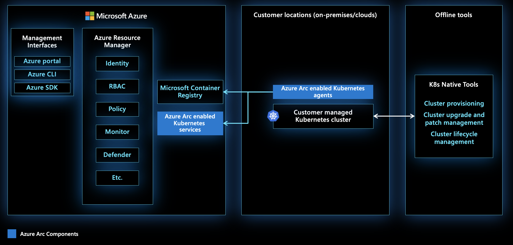

# MicroHack Azure Arc-enabled Kubernetes

- [**MicroHack Introduction**](#microhack-introduction)
  - [What is Azure Arc for Kubernetes?](#what-is-azure-arc-for-kubernetes)
- [**MicroHack Context**](#microhack-context)
- [**Objectives**](#objectives)
- [**MicroHack Challenges**](#microhack-challenges)
  - [General Prerequisites](#general-prerequisites)
  - [Challenge 1 - Onboarding your Kubernetes Cluster](#challenge-1---onboarding-your-kubernetes-cluster)
  - [Challenge 2 - Enable Azure Monitor for Containers](#challenge-2---enable-azure-monitor-for-containers)
  - [Challenge 3 - KAITO](#challenge-3---kaito)
  - [Challenge 4 - Deploy SQL Managed Instance](#challenge-4---deploy-sql-managed-instance-to-your-cluster)
  - [Challenge 5 - Configure GitOps for Cluster Management](#challenge-5---configure-gitops-for-cluster-management)

## MicroHack Introduction

### What is Azure Arc for Kubernetes?

Azure Arc-enabled Kubernetes allows you to attach Kubernetes clusters running anywhere so that you can manage and configure them in Azure. By managing all of your Kubernetes resources in a single control plane, you can enable a more consistent development and operation experience, helping you run cloud-native apps anywhere and on any Kubernetes platform.

Once your Kubernetes clusters are connected to Azure, you can:

- View all connected Kubernetes clusters for inventory, grouping, and tagging, along with your Azure Kubernetes Service (AKS) clusters.

- Configure clusters and deploy applications using GitOps-based configuration management.

- View and monitor your clusters using Azure Monitor for containers.

- Enforce threat protection using Microsoft Defender for Kubernetes.

- Ensure governance through applying policies with Azure Policy for Kubernetes.

- Grant access and connect to your Kubernetes clusters from anywhere, and manage access by using Azure role-based access control (RBAC) on your cluster.

- Deploy machine learning workloads using Azure Machine Learning for Kubernetes clusters.

- Deploy and manage Kubernetes applications from Azure Marketplace.

- Deploy Azure PaaS services that allow you to take advantage of specific hardware, comply with data residency requirements, or enable new scenarios. Examples of services include:

    - Azure Arc-enabled data services
    - Azure Machine Learning for Kubernetes clusters
    - Workload Orchestration
    - Event Grid on Kubernetes
    - App Services on Azure Arc
    - Open Service Mesh

## MicroHack Context

This MicroHack is a challenge-based experience which will walk you through the onboarding process and step by step enabling additional use cases.

💡 *Optional*: Have a look at the following resources after completing this lab to deepen your learning:

* [Azure Arc-enabled Kubernetes documentation](https://learn.microsoft.com/en-us/azure/azure-arc/kubernetes/)
* [Azure Arc Jumpstart - Arc-enabled Kubernetes](https://jumpstart.azure.com/azure_arc_jumpstart/azure_arc_k8s)
* [Azure Arc Jumpstart - Data Services](https://jumpstart.azure.com/azure_arc_jumpstart/azure_arc_data)
* [Azure Arc - Workload Orchestration](https://learn.microsoft.com/en-us/azure/azure-arc/workload-orchestration/overview)
* [Azure Arc Jumpstart - Machine Learning](https://jumpstart.azure.com/azure_arc_jumpstart/azure_arc_ml)
* [Azure Arc Jumpstart - Iot Operations](https://jumpstart.azure.com/azure_arc_jumpstart/azure_edge_iot_ops)
* [Speed Innovation with Arc-enabled Kubernetes Applications](https://techcommunity.microsoft.com/blog/azurearcblog/speed-innovation-with-arc-enabled-kubernetes-applications/4298658)
* [Azure Arc-Enabled Kubernetes now available on Azure Marketplace](https://techcommunity.microsoft.com/blog/azurearcblog/azure-arc-enabled-kubernetes-now-available-on-azure-marketplace/4034060)
* [Introduction to Azure Arc landing zone accelerator for hybrid and multicloud](https://learn.microsoft.com/en-us/azure/cloud-adoption-framework/scenarios/hybrid/enterprise-scale-landing-zone)

## Objectives

After completing this MicroHack you will be familiar with:

* How to connect your Kubernetes cluster running anywhere to Azure Arc
* Understand how you can streamline your operations and development processes for your Kubernetes clusters running anywhere
* Deploying Azure PaaS services such as SQL Managed Instance in your Kubernetes cluster running anywhere 

## MicroHack Challenges

In order to play through the challenges, your microhack coach prepared a k8s cluster for you, which you will use as your onprem environment. In the case of this microhack, we are using an AKS cluster for ease of environment provisioning. In a real world scenario this makes no sense of course, as AKS is already fully integrated in Azure and also, you would not deploy data services into an AKS cluster when you could do this natively in Azure...

For each user there are two resource groups pre-created by your coach. 
| Name                | Description                                                                               |
|---------------------|-------------------------------------------------------------------------------------------|
| mh-01-arc-k8s-onprem| In this resource group you can find the k8s cluster which mimicks your onprem environment |
| mh-01-arc-k8s       | Into this resource group your arc resources will be stored                                | 

### General Prerequisites

In order to successfully work through the challenges in this MicroHack, you will need the following prerequisites:

* [An Azure account with owner permissions on an active subscription](https://azure.microsoft.com/free/?WT.mc_id=A261C142F)
* [Azure CLI](https://learn.microsoft.com/en-us/cli/azure/install-azure-cli) (Hint: Make sure to use the lastest version)
* [kubectl](https://kubernetes.io/docs/tasks/tools/install-kubectl-linux/#install-using-native-package-management)
* [Helm] (https://helm.sh/docs/intro/install/)

💡*Hint*: The solution has been verified using [Visual Studio Code](https://code.visualstudio.com/) with integrated Linux Bash Shell ([WSL(https://learn.microsoft.com/en-us/windows/wsl/install)]). In order to clone this repository to your local system, use either git or the github plugin for VSC.

## Challenge 1 - Onboarding your Kubernetes Cluster

### Goal
In challenge 1 you will connect/onboard your existing K8s cluster to Azure Arc. 

### Actions
* Verify all prerequisites are in place
  * Resource Providers
  * Azure CLI extensions
  * Resource group (Name: mh-arc-k8s-<xy>)
  * Connectivity to required Azure endpoints
* Deploy the Azure Arc agent pods to your k8s cluster
* Assign permissions to view k8s resources in the Azure portal

### Success Criteria
* Your k8s cluster appears in the Azure portal under Azure Arc > Infrastructure > Kubernetes clusters and is in status "Connected"
* In the Azure portal below Kubernetes resources > Workloads you can see all deployments and pods running on your cluster.

### Learning Resources
* (https://learn.microsoft.com/en-us/azure/azure-arc/kubernetes/overview)
* (https://learn.microsoft.com/en-us/azure/azure-arc/kubernetes/quickstart-connect-cluster?tabs=azure-cli)
* (https://learn.microsoft.com/en-us/azure/azure-arc/kubernetes/azure-rbac)
* (https://learn.microsoft.com/en-us/azure/azure-arc/kubernetes/kubernetes-resource-view)
* (https://learn.microsoft.com/en-us/cli/azure/connectedk8s?view=azure-cli-latest)

### Solution - Spoilerwarning
[Solution Steps](walkthrough/01-connect/solution.md)

## Challenge 2 - Enable Azure Monitor for Containers

In this challenge, you’ll configure the core monitoring and governance capabilities that turn an Arc‑enabled k8s cluster into an enterprise‑ready platform. 
* Azure Monitor Container Insights provides real‑time visibility into cluster health, performance, and workload behavior, while
* Microsoft Defender for Kubernetes adds runtime threat detection and security hardening to protect your applications and infrastructure. 
* Azure Policy for Kubernetes ensures consistent governance by enforcing configuration and compliance standards across the cluster.

All telemetry, logs, and security signals generated by these services flow into Log Analytics, which serves as the central, scalable persistence layer for querying, alerting, and correlating operational and security data.

💡*Hint*: There is a [Monitoring microhack](../07_Azure_Monitor/README.md) which guides you on how to create alerts, dashboards and workbooks to operationalize your monitoring experience.

💡*Hint*: In this microhack we are focusing on infrastructure monitoring. But you easily can add application monitoring using either [Application Insights](https://learn.microsoft.com/en-us/azure/azure-monitor/app/app-insights-overview) or [Azure Managed Prometheus](https://learn.microsoft.com/en-us/azure/azure-monitor/metrics/prometheus-metrics-overview) for workloads running in your k8s cluster.

### Goal
* Establish foundational monitoring, security, and governance for an Arc‑enabled Kubernetes cluster

### Actions
* Create a Log Analytics workspace as centralized storage for all logs and metrics.
* Enable Azure Monitor – Container Insights via the Arc extension to collect cluster, node, pod, and container telemetry.
* Onboard the cluster to Microsoft Defender for Kubernetes to activate runtime threat detection and security posture management.
* Assign Azure Policy for Kubernetes to enforce governance rules and ensure consistent configuration and compliance across the cluster.

### Success Criteria
* Validated cluster health, node performance, workload status and container logs using the Azure Portal
* Defender for Kubernetes displays active security assessments, no onboarding errors, and visible recommendations and alerts.
* Azure Policy shows evaluated policy results with compliant/non‑compliant resources and enforcement functioning as expected.
* Telemetry from all components is visible and queryable in Log Analytics, confirming correct data ingestion and workspace linkage.

### Learning Resources
* (https://learn.microsoft.com/en-us/azure/azure-monitor/containers/kubernetes-monitoring-overview)
* (https://learn.microsoft.com/en-us/azure/azure-monitor/containers/kubernetes-monitoring-enable)
* (https://learn.microsoft.com/en-us/azure/defender-for-cloud/defender-for-containers-arc-enable-programmatically)

### Solution - Spoilerwarning
[Solution Steps](walkthrough/02-azure-monitor/solution.md)

## Challenge 3 - KAITO

### Goal

### Actions

### Success Criteria

### Learning Resources

### Solution - Spoilerwarning

## Challenge 4 - Deploy SQL Managed Instance to your cluster

### Goal

### Actions

### Success Criteria

### Learning Resources

### Solution - Spoilerwarning

## Challenge 5 - Configure Gitops for cluster management

### Goal

### Actions

### Success Criteria

### Learning Resources

### Solution - Spoilerwarning

## Challenge 6 (optional) - Improve Governance using Azure Policy for Kubernetes

### Goal

### Actions

### Success Criteria

### Learning Resources

### Solution - Spoilerwarning

## Challenge 7 (optional) - Ship Azure Machine Learning Container to your cluster

## Contributors
* Simon Schwingel [GitHub](https://github.com/skiddder); [LinkedIn](https://www.linkedin.com/in/simon-schwingel-b602869a/)