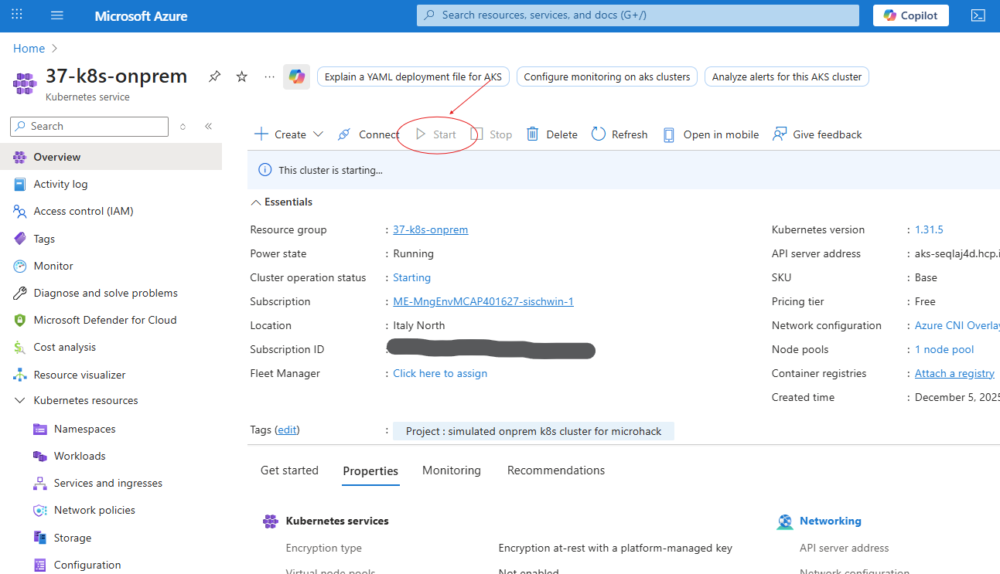

# Walkthrough Challenge 1 - Onboarding your Kubernetes Cluster
Duration: 20 minutes

[Home](../../Readme.md#challenge-1---onboarding-your-kubernetes-cluster) - [Next Challenge's Solution](../02-azure_monitor/solution.md)

## Prerequisites
Please ensure that you successfully verified 
* the [general prerequisites](../../Readme.md#general-prerequisites) before starting this challenge.
* that you can see your two resource groups in the [Azure portal](https://portal.azure.com) depending on your LabUser number. I.e. if you are LabUser-37, you should see the resource groups "37-k8s-arc" and "37-k8s-onprem".
* that you can successfully connect to all [required Azure endpoings](https://learn.microsoft.com/en-us/azure/azure-arc/kubernetes/network-requirements?tabs=azure-cloud)

## Task 1 - Login to Azure
In your shell environment, login to Azure using the account you got assigned during the microhack.
```bash
az logout # only required if you are logged in with another user from a previous session

az login # browser popup opens with credential prompt. Provide the user credentials you got from your microhack coach
```
In case you are prompted to select a subscription, please do so. In the microhack environment you just can hit enter as you only have one subscription available.

Validate that you can see your two resource groups in the [Azure portal](https://portal.azure.com) depending on your LabUser number. I.e. if you are LabUser-37, you should see the resource groups "37-k8s-arc" and "37-k8s-onprem". 
Click on your onprem resource group's name (i.e. 37-k8s-onprem).
There should be an aks resource in this resource group. Click on its name and validate that the cluster is running. In case it's stopped, start it.


## Task 2 - Connect K8s cluster using script
* In your shell go the folder where you cloned the microhack repository. Then change to the folder '03-Azure/01-03-Infrastructure/03_Hybrid_Azure_Arc_Kubernetes/walkthrough/01-connect/'
* Open file az_connect_aks.sh in your editor - i.e. in Visual Studio Code. 
* Check the export variable values and adjust the values to match your environment (i.e. replace "37" with "04" if you are LabUser-04) and save your changes. 

```bash
# adjust the prefix according to your microhack user number
export onprem_aks_cluster_name='37-k8s-onprem'  
export onprem_resource_group='37-k8s-onprem'
export arc_resource_group='37-k8s-arc'
export arc_cluster_name='37-k8s-arc-enabled'
```

* Execute the script to
    * register required resource providers in your subscription (this step may take several minutes if the resource providers have not been registered before):
        * Microsoft.Kubernetes
        * Microsoft.KubernetesConfiguration
        * Microsoft.ExtendedLocation
    * merge the AKS credentials of the onprem cluster into your kube.config file
    * remove Azure Arc helm charts which might exist from previous connection attempts
    * install required Azure CLI extensions or update them to latest version:
        * connectedk8s
        * k8s-configuration
    * connecting the simulated onprem cluster to Azure Arc using the Azure CLI approach

💡 ATTENTION: The k8s cluster to be onboarded as a connected cluster must be the default cluster in kubeconfig. The az_connect_aks.sh script fetches the aks credentials and merges it into kubeconfig for you. 

```bash
./az_connect_aks.sh 
```

Wait until the script terminates. Expected result sould look comparable to this out:
```bash
Exporting environment variables
Registering Azure Arc providers
Namespace             RegistrationPolicy    RegistrationState
--------------------  --------------------  -------------------
Microsoft.Kubernetes  RegistrationRequired  Registered
Namespace                          RegistrationPolicy    RegistrationState
---------------------------------  --------------------  -------------------
Microsoft.KubernetesConfiguration  RegistrationRequired  Registered
Namespace                   RegistrationPolicy    RegistrationState
--------------------------  --------------------  -------------------
Microsoft.ExtendedLocation  RegistrationRequired  Registered
Getting AKS credentials (kubeconfig)
Merged "37-k8s-onprem" as current context in /home/simon/.kube/config
Clear cached helm Azure Arc Helm Charts
Checking if you have up-to-date Azure Arc AZ CLI 'connectedk8s' extension...
Latest version of 'connectedk8s' is already installed.

Use --debug for more information

Checking if you have up-to-date Azure Arc AZ CLI 'k8s-configuration' extension...
Latest version of 'k8s-configuration' is already installed.

Use --debug for more information

Connecting the cluster to Azure Arc
This operation might take a while...

Step: 2025-12-12T14-32-41Z: Validating custom access token
Step: 2025-12-12T14-32-41Z: Checking Provider Registrations
Step: 2025-12-12T14-32-42Z: Setting KubeConfig
Step: 2025-12-12T14-32-42Z: Escape Proxy Settings, if passed in
Step: 2025-12-12T14-32-42Z: Checking Connectivity to Cluster
Step: 2025-12-12T14-32-43Z: Do node validations
Step: 2025-12-12T14-32-43Z: Install Kubectl client if it does not exist
Step: 2025-12-12T14-32-43Z: Install Helm client if it does not exist
Step: 2025-12-12T14-32-43Z: Starting Pre-onboarding-check
Step: 2025-12-12T14-32-43Z: Creating folder for Cluster Diagnostic Checks Logs
Step: 2025-12-12T14-32-43Z: Get namespace of release: cluster-diagnostic-checks
Step: 2025-12-12T14-32-44Z: Determine Helmchart Export Path
Step: 2025-12-12T14-32-44Z: Pulling HelmChart: mcr.microsoft.com/azurearck8s/helmchart/stable/clusterdiagnosticchecks, Version: 1.31.2
Step: 2025-12-12T14-32-46Z: Chart path for Cluster Diagnostic Checks Job: /home/simon/.azure/PreOnboardingChecksCharts/clusterdiagnosticchecks
Step: 2025-12-12T14-32-46Z: Creating Cluster Diagnostic Checks job
Step: 2025-12-12T14-32-59Z: The required pre-checks for onboarding have succeeded.
Step: 2025-12-12T14-32-59Z: Checking if user can create ClusterRoleBindings
Step: 2025-12-12T14-32-59Z: Determining Cluster Distribution and Infrastructure
Connecting an Azure Kubernetes Service (AKS) cluster to Azure Arc is only required for running Arc enabled services like App Services and Data Services on the cluster. Other features like Azure Monitor and Azure Defender are natively available on AKS. Learn more at https://go.microsoft.com/fwlink/?linkid=2144200.
Step: 2025-12-12T14-32-59Z: Checking Connect RP is available in the Location passed in.
Step: 2025-12-12T14-32-59Z: Check if an earlier azure-arc release exists
Step: 2025-12-12T14-32-59Z: Get namespace of release: azure-arc
Step: 2025-12-12T14-33-01Z: Deleting Arc CRDs
Step: 2025-12-12T14-33-09Z: Check if ResourceGroup exists.  Try to create if it doesn't
Step: 2025-12-12T14-33-09Z: Generating Public-Private Key pair
Step: 2025-12-12T14-33-14Z: Generating ARM Request Payload
Step: 2025-12-12T14-33-14Z: Azure resource provisioning has begun.
Step: 2025-12-12T14-34-49Z: Checking Custom Location(Microsoft.ExtendedLocation) RP Registration state for this Subscription, and attempt to get the Custom Location Object ID (OID),if registered
Step: 2025-12-12T14-34-52Z: Azure resource provisioning has finished.
Step: 2025-12-12T14-34-53Z: Determine Helmchart Export Path
Step: 2025-12-12T14-34-53Z: Pulling HelmChart: mcr.microsoft.com/azurearck8s/batch1/stable/v2/azure-arc-k8sagents, Version: 1.31.3
Step: 2025-12-12T14-34-55Z: Starting to install Azure arc agents on the Kubernetes cluster.
{
  "aadProfile": {
    "adminGroupObjectIDs": null,
    "enableAzureRbac": null,
    "tenantId": null
  },
  [...]
    "arcAgentProfile": {
    "agentAutoUpgrade": "Enabled",
    "agentErrors": null,
    "agentState": null,
    "desiredAgentVersion": null,
    "systemComponents": null
  },
  "arcAgentryConfigurations": null,
  "azureHybridBenefit": "NotApplicable",
  "connectivityStatus": "Connecting",
  "distribution": "aks",
  "distributionVersion": null,
  "gateway": null,
  [...]
  "location": "westeurope",
  "managedIdentityCertificateExpirationTime": null,
  "miscellaneousProperties": null,
  "name": "37-k8s-arc-enabled",
  "offering": null,
  "oidcIssuerProfile": null,
  "privateLinkScopeResourceId": null,
  "privateLinkState": "Disabled",
  "provisioningState": "Succeeded",
  "resourceGroup": "37-k8s-arc",
  "securityProfile": null,
  [...]
  "tags": {},
  "totalCoreCount": null,
  "totalNodeCount": null,
  "type": "microsoft.kubernetes/connectedclusters"
}
```
In the [Azure portal](https://portal.azure.com) type 'Azure Arc' into the search bar at the top of the page. In the results in section 'Services' click 'Azure Arc'.
In the Azure Arc page in the left navigation pane, open the 'infrastucture' section and click 'Kubernetes clusters'.
You should see your resource of type 'Kubernetes - Azure Arc'. (i.e. if you are LabUser-37 you should see a resource named '37-k8s-arc-enabled'). Click on the name of the resource matching your user number.

Notice the Arc Agent version in the overview page.

In the navigation pane in section 'Kubernetes resources' click on 'Namespaces'. Next to the default namespaces you should see 


You successfully completed challenge 1! 🚀🚀🚀

[Back to the challenges](../../Readme.md#challenge-2---configure-gitops-for-cluster-management) - [Next Challenge's Solution](../02-azure_monitor/solution.md)